# Michael 시스템 아키텍처

## 개요

Michael은 24시간 깨어있는 개인 AI 어시스턴트입니다. Hub-and-Spoke 아키텍처를 채택하여 Gateway가 중앙 메시지 허브 역할을 하고, 각 컴포넌트가 WebSocket으로 연결됩니다. 특화 에이전트(Finance Agent 등)는 A2A 프로토콜을 통해 독립적으로 운영됩니다.

---

## 전체 시스템 구조


```mermaid
graph TB
    subgraph External["외부 서비스"]
        TG[Telegram API]
        NGROK[ngrok Tunnel]
        CLAUDE[Claude CLI]
        YFINANCE[yfinance]
        COINGECKO[CoinGecko API]
        EXCHANGE[Exchange Rate API]
    end

    subgraph Frontend["Frontend Layer :3001"]
        NEXT[Next.js App]
        A2UI_RENDER[A2UI Renderer]
        AGUI_CLIENT[AG-UI Client]
    end

    subgraph HTTP["HTTP Layer :3000"]
        HS[HTTP Server]
        STATIC["/webapp/* Static Files"]
        API["/api/* REST API"]
        SSE["/api/chat/stream SSE"]
        HEALTH["/health"]
    end

    subgraph Core["Core Layer :18789"]
        GW[Gateway<br/>WebSocket Hub]
    end

    subgraph Channels["Channels"]
        TC[Telegram Channel]
        WC[Web Channel]
    end

    subgraph Brain["Brain"]
        MEM[(Memory<br/>SQLite)]
        VEC[(Vector Index<br/>sqlite-vec)]
    end

    subgraph Services["Services"]
        AGENT[Claude Agent]
        SCHED[Scheduler]
        WEBAPP[WebApp Manager]
    end

    subgraph SpecializedAgents["Specialized Agents"]
        FA[Finance Agent<br/>:8001]
        FA_EXEC[FinanceAgentExecutor]
        FA_SCRIPTS[Finance Scripts]
    end

    subgraph UI["UI Layer"]
        MINIAPP[Telegram Mini App<br/>React]
    end

    %% Frontend connections
    NEXT --> AGUI_CLIENT
    AGUI_CLIENT -->|SSE| SSE
    NEXT --> A2UI_RENDER

    %% External connections
    TG <-->|Polling| TC
    NGROK -->|HTTPS| HS
    CLAUDE <-->|Subprocess| AGENT
    CLAUDE <-->|Subprocess| FA_EXEC

    %% Finance Agent external
    FA_SCRIPTS --> YFINANCE
    FA_SCRIPTS --> COINGECKO
    FA_SCRIPTS --> EXCHANGE

    %% HTTP connections
    HS --> STATIC
    HS --> API
    HS --> SSE
    HS --> HEALTH
    MINIAPP -->|fetch| API

    %% Gateway connections
    TC <-->|WebSocket| GW
    WC <-->|WebSocket| GW
    AGENT <-->|Direct| GW
    SCHED -->|Broadcast| GW

    %% Brain connections
    AGENT --> MEM
    AGENT --> VEC
    TC --> WEBAPP
    WEBAPP --> MEM

    %% Scheduler
    SCHED --> MEM

    %% Finance Agent
    FA --> FA_EXEC
    FA_EXEC --> FA_SCRIPTS
```

---

## 서비스 포트 구성

| 서비스 | 포트 | 프로토콜 | 설명 |
|--------|------|----------|------|
| Frontend | 3001 | HTTP | Next.js 웹 채팅 UI |
| HTTP Server | 3000 | HTTP | REST API, Mini App, SSE |
| Gateway | 18789 | WebSocket | 중앙 메시지 허브 |
| Finance Agent | 8001 | HTTP (A2A) | 금융 데이터 에이전트 |

---

## 컴포넌트 상세

### 1. Gateway (WebSocket Hub)

중앙 메시지 라우터로서 모든 컴포넌트 간 통신을 중재합니다.

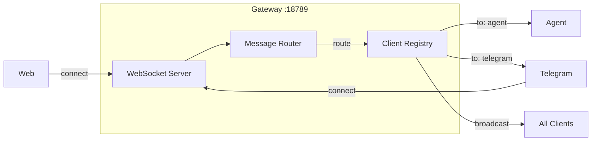
```mermaid
graph LR
    subgraph Gateway["Gateway :18789"]
        WS[WebSocket Server]
        ROUTER[Message Router]
        CLIENTS[Client Registry]
    end

    TC[Telegram] -->|connect| WS
    WC[Web] -->|connect| WS
    WS --> ROUTER
    ROUTER -->|route| CLIENTS
    CLIENTS -->|to: agent| AGENT[Agent]
    CLIENTS -->|to: telegram| TC
    CLIENTS -->|broadcast| ALL[All Clients]
```

**메시지 프로토콜:**
```typescript
interface GatewayMessage {
  from: 'telegram' | 'web' | 'scheduler' | 'agent';
  to: 'agent' | 'telegram' | 'web' | 'broadcast';
  userId: string;
  content: string;
  metadata?: {
    chatId?: number;
    eventType?: string;  // AG-UI event
    runId?: string;
    // ...
  };
}
```

### 2. HTTP Server

Mini App 서빙, REST API, SSE 스트리밍을 담당합니다.

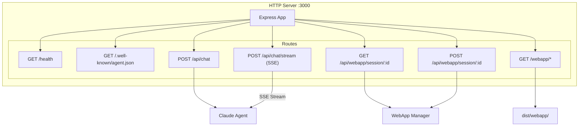
```mermaid
graph TB
    subgraph HTTPServer["HTTP Server :3000"]
        EXPRESS[Express App]

        subgraph Routes["Routes"]
            R1["GET /health"]
            R2["GET /.well-known/agent.json"]
            R3["POST /api/chat"]
            R4["POST /api/chat/stream (SSE)"]
            R5["GET /api/webapp/session/:id"]
            R6["POST /api/webapp/session/:id"]
            R7["GET /webapp/*"]
        end
    end

    EXPRESS --> R1
    EXPRESS --> R2
    EXPRESS --> R3
    EXPRESS --> R4
    EXPRESS --> R5
    EXPRESS --> R6
    EXPRESS --> R7

    R3 --> AGENT[Claude Agent]
    R4 -->|SSE Stream| AGENT
    R5 --> WAM[WebApp Manager]
    R6 --> WAM
    R7 --> DIST[dist/webapp/]
```

### 3. Telegram Channel

Telegram Bot API와 통신하고 Mini App을 관리합니다.

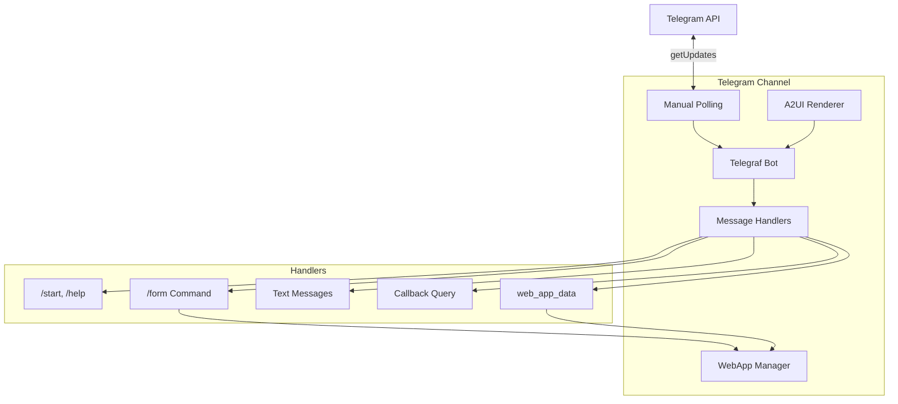
```mermaid
graph TB
    subgraph TelegramChannel["Telegram Channel"]
        BOT[Telegraf Bot]
        POLL[Manual Polling]
        HANDLERS[Message Handlers]
        RENDERER[A2UI Renderer]
        WAM[WebApp Manager]
    end

    TGAPI[Telegram API] <-->|getUpdates| POLL
    POLL --> BOT
    BOT --> HANDLERS

    subgraph HandlersDetail["Handlers"]
        H1["/start, /help"]
        H2["/form Command"]
        H3["Text Messages"]
        H4["Callback Query"]
        H5["web_app_data"]
    end

    HANDLERS --> H1
    HANDLERS --> H2
    HANDLERS --> H3
    HANDLERS --> H4
    HANDLERS --> H5

    H2 --> WAM
    H5 --> WAM
    RENDERER --> BOT
```

### 4. Claude Agent

Claude CLI를 subprocess로 실행하여 AI 응답을 생성합니다.

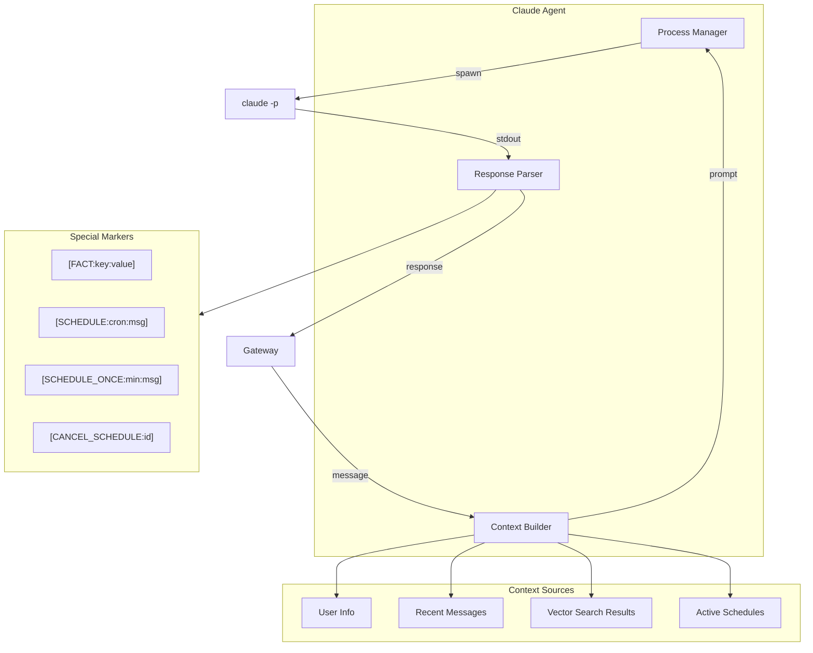
```mermaid
graph TB
    subgraph ClaudeAgent["Claude Agent"]
        PROC[Process Manager]
        CTX[Context Builder]
        PARSE[Response Parser]
    end

    subgraph Context["Context Sources"]
        USER[User Info]
        MSG[Recent Messages]
        VEC[Vector Search Results]
        SCHED[Active Schedules]
    end

    subgraph Markers["Special Markers"]
        M1["[FACT:key:value]"]
        M2["[SCHEDULE:cron:msg]"]
        M3["[SCHEDULE_ONCE:min:msg]"]
        M4["[CANCEL_SCHEDULE:id]"]
    end

    GW[Gateway] -->|message| CTX
    CTX --> USER
    CTX --> MSG
    CTX --> VEC
    CTX --> SCHED
    CTX -->|prompt| PROC
    PROC -->|spawn| CLI[claude -p]
    CLI -->|stdout| PARSE
    PARSE --> Markers
    PARSE -->|response| GW
```

### 5. Finance Agent (A2A)

실시간 금융 데이터를 조회하고 A2UI 형식으로 응답하는 특화 에이전트입니다.

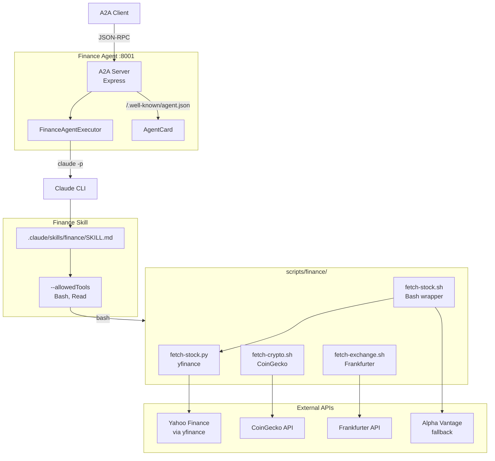
```mermaid
graph TB
    subgraph FinanceAgent["Finance Agent :8001"]
        SERVER[A2A Server<br/>Express]
        EXECUTOR[FinanceAgentExecutor]
        CARD[AgentCard]
    end

    subgraph Scripts["scripts/finance/"]
        S1[fetch-stock.py<br/>yfinance]
        S2[fetch-stock.sh<br/>Bash wrapper]
        S3[fetch-crypto.sh<br/>CoinGecko]
        S4[fetch-exchange.sh<br/>Frankfurter]
    end

    subgraph Skill["Finance Skill"]
        SKILL[.claude/skills/finance/SKILL.md]
        ALLOWED[--allowedTools<br/>Bash, Read]
    end

    subgraph External["External APIs"]
        YAHOO[Yahoo Finance<br/>via yfinance]
        GECKO[CoinGecko API]
        FRANK[Frankfurter API]
        ALPHA[Alpha Vantage<br/>fallback]
    end

    CLIENT[A2A Client] -->|JSON-RPC| SERVER
    SERVER --> EXECUTOR
    EXECUTOR -->|claude -p| CLI[Claude CLI]
    CLI --> SKILL
    SKILL --> ALLOWED
    ALLOWED -->|bash| Scripts

    S1 --> YAHOO
    S2 --> S1
    S2 --> ALPHA
    S3 --> GECKO
    S4 --> FRANK

    SERVER -->|/.well-known/agent.json| CARD
```

**Finance Agent 데이터 소스:**

| 데이터 | 소스 | 스크립트 | Rate Limit |
|--------|------|----------|-----------|
| 미국 주식 | yfinance | `fetch-stock.py` | 없음 |
| 한국 주식 | yfinance | `fetch-stock.py` | 없음 |
| 암호화폐 | CoinGecko | `fetch-crypto.sh` | 10-30 req/min |
| 환율 | Frankfurter | `fetch-exchange.sh` | 없음 |

**Fallback 체인:**
```
yfinance (Python) → Yahoo Finance API → Alpha Vantage
```

### 6. Memory System

두 개의 SQLite 데이터베이스로 구성됩니다.

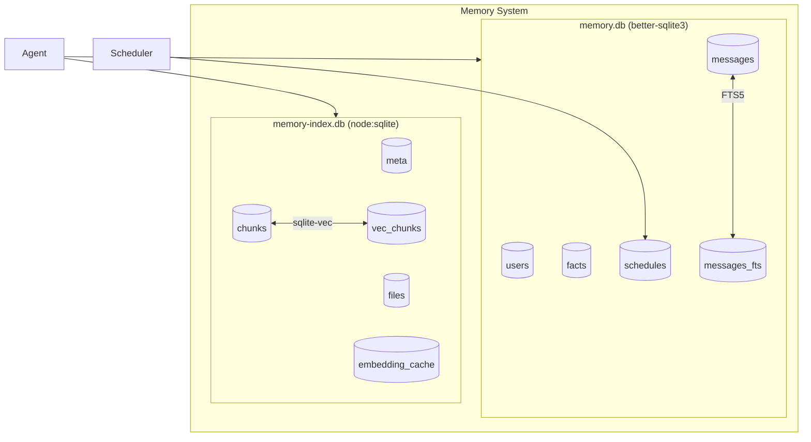
```mermaid
graph TB
    subgraph Memory["Memory System"]
        subgraph MainDB["memory.db (better-sqlite3)"]
            USERS[(users)]
            MESSAGES[(messages)]
            FACTS[(facts)]
            SCHEDULES[(schedules)]
            FTS[(messages_fts)]
        end

        subgraph VectorDB["memory-index.db (node:sqlite)"]
            META[(meta)]
            FILES[(files)]
            CHUNKS[(chunks)]
            CACHE[(embedding_cache)]
            VEC_CHUNKS[(vec_chunks)]
        end
    end

    AGENT[Agent] --> MainDB
    AGENT --> VectorDB
    SCHED[Scheduler] --> SCHEDULES

    MESSAGES <-->|FTS5| FTS
    CHUNKS <-->|sqlite-vec| VEC_CHUNKS
```

---

## 데이터 흐름

### 1. 일반 대화 흐름

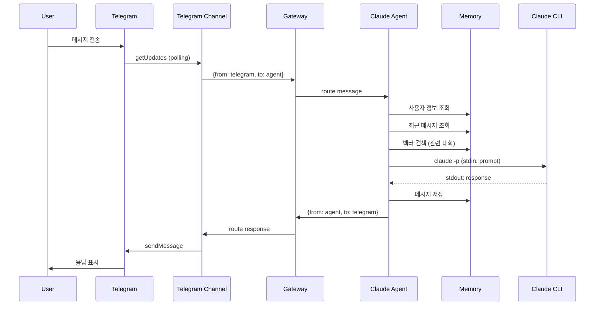
```mermaid
sequenceDiagram
    participant U as User
    participant T as Telegram
    participant TC as Telegram Channel
    participant GW as Gateway
    participant A as Claude Agent
    participant M as Memory
    participant C as Claude CLI

    U->>T: 메시지 전송
    T->>TC: getUpdates (polling)
    TC->>GW: {from: telegram, to: agent}
    GW->>A: route message

    A->>M: 사용자 정보 조회
    A->>M: 최근 메시지 조회
    A->>M: 벡터 검색 (관련 대화)
    A->>C: claude -p (stdin: prompt)
    C-->>A: stdout: response

    A->>M: 메시지 저장
    A->>GW: {from: agent, to: telegram}
    GW->>TC: route response
    TC->>T: sendMessage
    T->>U: 응답 표시
```

### 2. 금융 정보 조회 흐름 (메인 Agent)

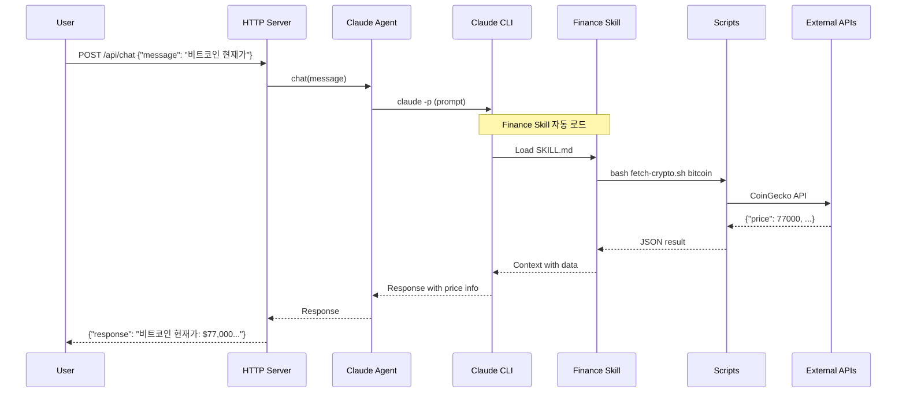
```mermaid
sequenceDiagram
    participant U as User
    participant HS as HTTP Server
    participant A as Claude Agent
    participant C as Claude CLI
    participant FS as Finance Skill
    participant S as Scripts
    participant API as External APIs

    U->>HS: POST /api/chat {"message": "비트코인 현재가"}
    HS->>A: chat(message)
    A->>C: claude -p (prompt)

    Note over C,FS: Finance Skill 자동 로드
    C->>FS: Load SKILL.md
    FS->>S: bash fetch-crypto.sh bitcoin
    S->>API: CoinGecko API
    API-->>S: {"price": 77000, ...}
    S-->>FS: JSON result
    FS-->>C: Context with data

    C-->>A: Response with price info
    A-->>HS: Response
    HS-->>U: {"response": "비트코인 현재가: $77,000..."}
```

### 3. Finance Agent A2A 호출 흐름

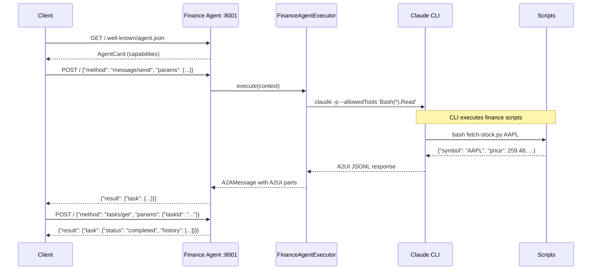
```mermaid
sequenceDiagram
    participant C as Client
    participant FA as Finance Agent :8001
    participant EX as FinanceAgentExecutor
    participant CLI as Claude CLI
    participant S as Scripts

    C->>FA: GET /.well-known/agent.json
    FA-->>C: AgentCard (capabilities)

    C->>FA: POST / {"method": "message/send", "params": {...}}
    FA->>EX: execute(context)
    EX->>CLI: claude -p --allowedTools 'Bash(*),Read'

    Note over CLI,S: CLI executes finance scripts
    CLI->>S: bash fetch-stock.py AAPL
    S-->>CLI: {"symbol": "AAPL", "price": 259.48, ...}

    CLI-->>EX: A2UI JSONL response
    EX-->>FA: A2AMessage with A2UI parts
    FA-->>C: {"result": {"task": {...}}}

    C->>FA: POST / {"method": "tasks/get", "params": {"taskId": "..."}}
    FA-->>C: {"result": {"task": {"status": "completed", "history": [...]}}}
```

### 4. Mini App 폼 제출 흐름

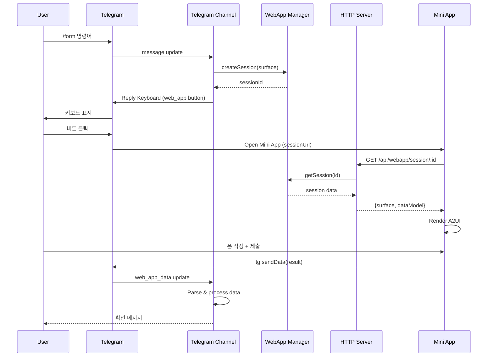
```mermaid
sequenceDiagram
    participant U as User
    participant T as Telegram
    participant TC as Telegram Channel
    participant WM as WebApp Manager
    participant HS as HTTP Server
    participant MA as Mini App

    U->>T: /form 명령어
    T->>TC: message update
    TC->>WM: createSession(surface)
    WM-->>TC: sessionId
    TC->>T: Reply Keyboard (web_app button)
    T->>U: 키보드 표시

    U->>T: 버튼 클릭
    T->>MA: Open Mini App (sessionUrl)
    MA->>HS: GET /api/webapp/session/:id
    HS->>WM: getSession(id)
    WM-->>HS: session data
    HS-->>MA: {surface, dataModel}
    MA->>MA: Render A2UI

    U->>MA: 폼 작성 + 제출
    MA->>T: tg.sendData(result)
    T->>TC: web_app_data update
    TC->>TC: Parse & process data
    TC-->>U: 확인 메시지
```

### 5. 스케줄 알림 흐름

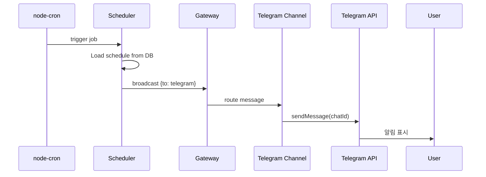
```mermaid
sequenceDiagram
    participant CRON as node-cron
    participant S as Scheduler
    participant GW as Gateway
    participant TC as Telegram Channel
    participant T as Telegram API
    participant U as User

    CRON->>S: trigger job
    S->>S: Load schedule from DB
    S->>GW: broadcast {to: telegram}
    GW->>TC: route message
    TC->>T: sendMessage(chatId)
    T->>U: 알림 표시
```

---

## 프로토콜 통합

### AG-UI (Agent-User Interface)

실시간 이벤트 스트리밍 프로토콜입니다.

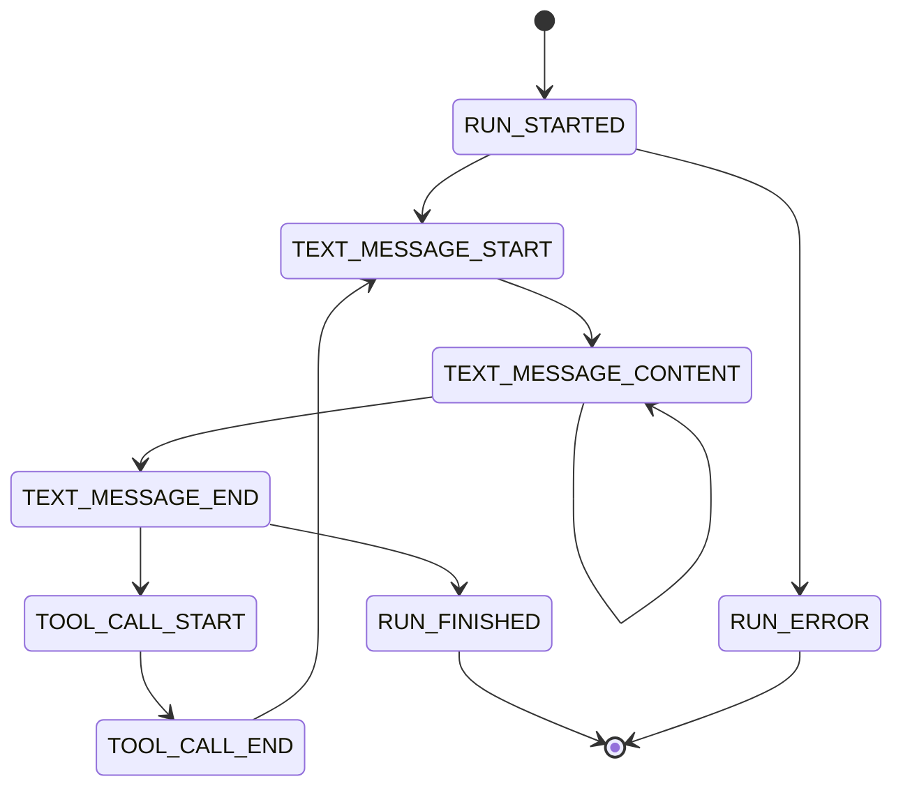
```mermaid
stateDiagram-v2
    [*] --> RUN_STARTED
    RUN_STARTED --> TEXT_MESSAGE_START
    TEXT_MESSAGE_START --> TEXT_MESSAGE_CONTENT
    TEXT_MESSAGE_CONTENT --> TEXT_MESSAGE_CONTENT
    TEXT_MESSAGE_CONTENT --> TEXT_MESSAGE_END
    TEXT_MESSAGE_END --> TOOL_CALL_START
    TOOL_CALL_START --> TOOL_CALL_END
    TOOL_CALL_END --> TEXT_MESSAGE_START
    TEXT_MESSAGE_END --> RUN_FINISHED
    RUN_FINISHED --> [*]

    RUN_STARTED --> RUN_ERROR
    RUN_ERROR --> [*]
```

### A2UI (Agent-Driven UI)

선언적 UI 명세 프로토콜입니다.

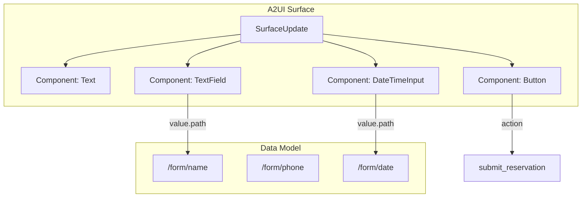
```mermaid
graph TB
    subgraph A2UI["A2UI Surface"]
        SURFACE[SurfaceUpdate]
        SURFACE --> COMP1[Component: Text]
        SURFACE --> COMP2[Component: TextField]
        SURFACE --> COMP3[Component: Button]
        SURFACE --> COMP4[Component: DateTimeInput]
    end

    subgraph DataModel["Data Model"]
        DM["/form/name"]
        DM2["/form/phone"]
        DM3["/form/date"]
    end

    COMP2 -->|value.path| DM
    COMP4 -->|value.path| DM3
    COMP3 -->|action| ACTION[submit_reservation]
```

### A2A (Agent-to-Agent) v0.3.0

JSON-RPC 2.0 기반 에이전트 간 통신 프로토콜입니다.

**핵심 타입 (v0.3.0 표준):**

```typescript
// Task 구조
interface Task {
  id: string;
  contextId?: string;              // 대화 연속성을 위한 컨텍스트 ID
  status: TaskStatusInfo;          // 상태 정보 객체
  artifacts?: TaskArtifact[];      // 출력 아티팩트
  history?: A2AMessage[];          // 메시지 히스토리
  createdAt: string;
  updatedAt: string;
  error?: string;
  metadata?: Record<string, unknown>;
}

// 상태 정보 (v0.3.0)
interface TaskStatusInfo {
  state: 'pending' | 'working' | 'completed' | 'failed' | 'cancelled';
  timestamp: string;
  message?: string;
}
```

**지원 메서드:**

| 메서드 | 설명 |
|--------|------|
| `message/send` | 메시지 전송, Task 반환 |
| `message/stream` | SSE 스트리밍 응답 |
| `tasks/get` | Task 상태 조회 |
| `tasks/list` | Task 목록 조회 |
| `tasks/cancel` | Task 취소 |
| `tasks/subscribe` | Task 업데이트 SSE 구독 |
| `tasks/pushNotificationConfig/*` | 웹훅 설정 CRUD |

**에러 코드:**

| 코드 | 이름 | 설명 |
|------|------|------|
| `-32000` | TASK_NOT_FOUND | 태스크 없음 |
| `-32001` | PUSH_NOTIFICATION_NOT_SUPPORTED | 푸시 미지원 |
| `-32010` | TASK_CANCELLED | 태스크 취소됨 |
| `-32011` | AGENT_UNAVAILABLE | 에이전트 불가 |
| `-32014` | CONFIG_NOT_FOUND | 설정 없음 |

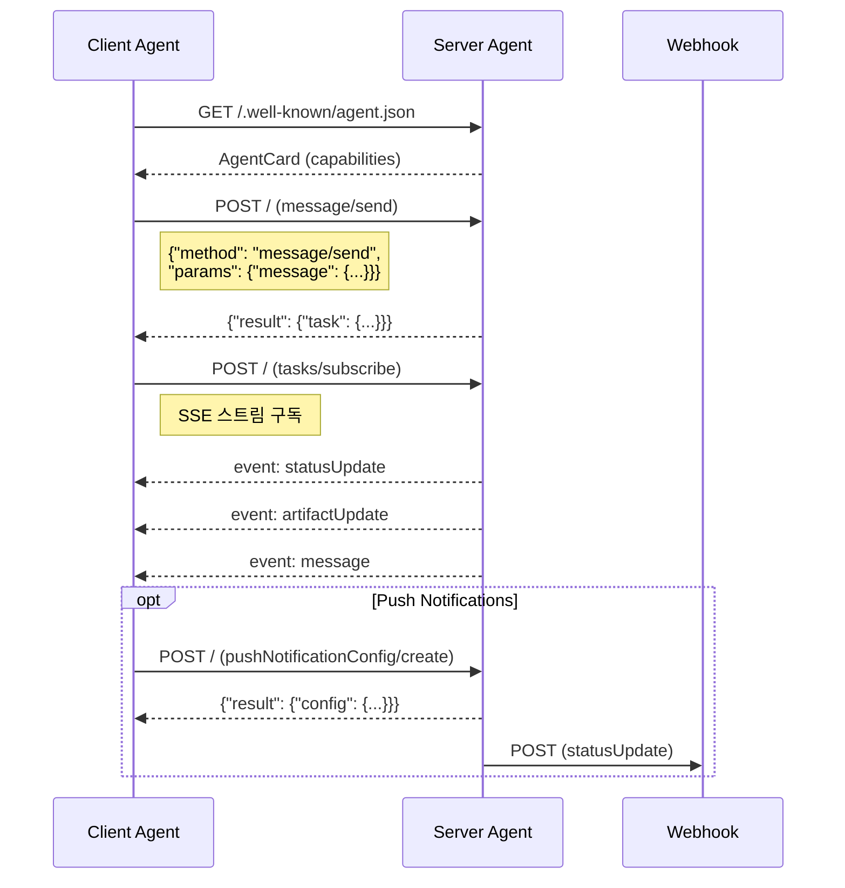
```mermaid
sequenceDiagram
    participant C as Client Agent
    participant S as Server Agent
    participant WH as Webhook

    C->>S: GET /.well-known/agent.json
    S-->>C: AgentCard (capabilities)

    C->>S: POST / (message/send)
    Note right of C: {"method": "message/send",<br/>"params": {"message": {...}}}
    S-->>C: {"result": {"task": {...}}}

    C->>S: POST / (tasks/subscribe)
    Note right of C: SSE 스트림 구독
    S-->>C: event: statusUpdate
    S-->>C: event: artifactUpdate
    S-->>C: event: message

    opt Push Notifications
        C->>S: POST / (pushNotificationConfig/create)
        S-->>C: {"result": {"config": {...}}}
        S->>WH: POST (statusUpdate)
    end
```

**Orchestrator (멀티 에이전트):**

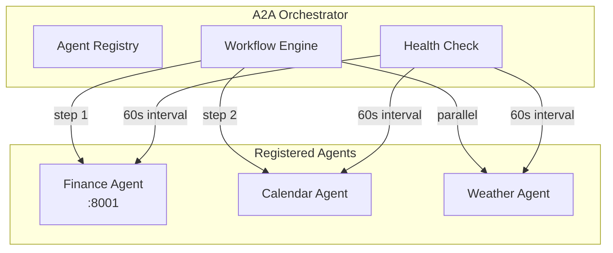
```mermaid
graph TB
    subgraph Orchestrator["A2A Orchestrator"]
        REG[Agent Registry]
        HEALTH[Health Check]
        WORKFLOW[Workflow Engine]
    end

    subgraph Agents["Registered Agents"]
        A1[Finance Agent<br/>:8001]
        A2[Calendar Agent]
        A3[Weather Agent]
    end

    WORKFLOW -->|step 1| A1
    WORKFLOW -->|step 2| A2
    WORKFLOW -->|parallel| A3
    HEALTH -->|60s interval| A1
    HEALTH -->|60s interval| A2
    HEALTH -->|60s interval| A3
```

---

## 데이터베이스 스키마

### Main DB (memory.db)

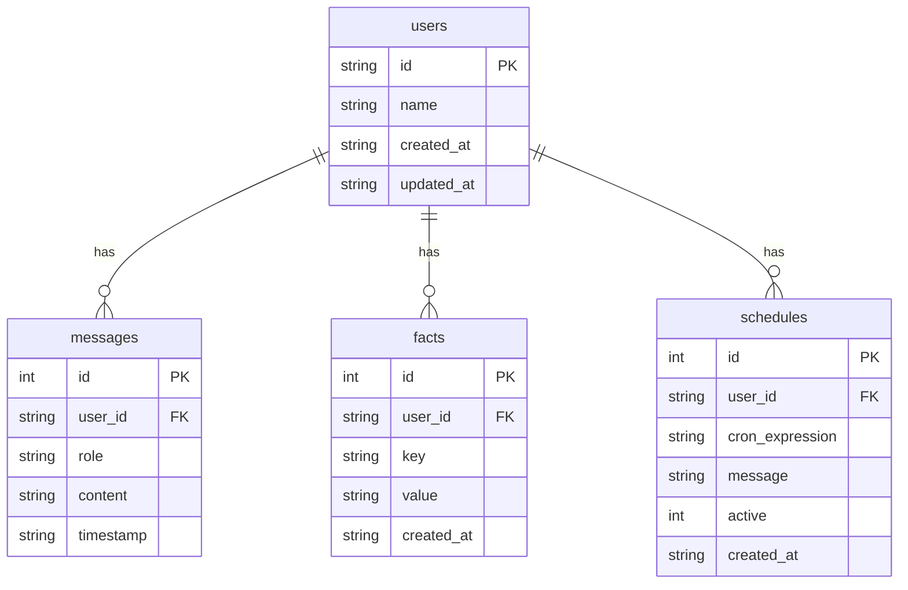
```mermaid
erDiagram
    users {
        string id PK
        string name
        string created_at
        string updated_at
    }

    messages {
        int id PK
        string user_id FK
        string role
        string content
        string timestamp
    }

    facts {
        int id PK
        string user_id FK
        string key
        string value
        string created_at
    }

    schedules {
        int id PK
        string user_id FK
        string cron_expression
        string message
        int active
        string created_at
    }

    users ||--o{ messages : has
    users ||--o{ facts : has
    users ||--o{ schedules : has
```

### Vector DB (memory-index.db)

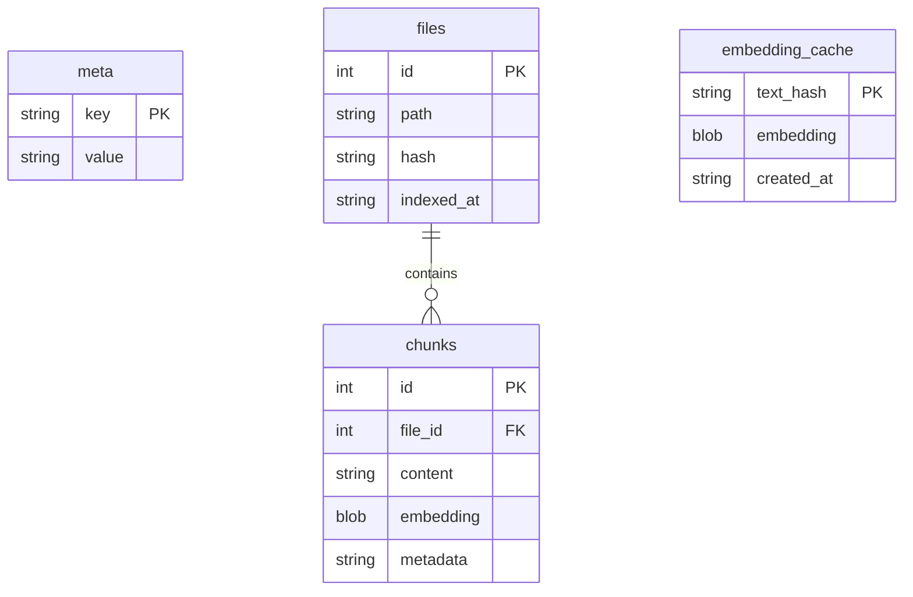
```mermaid
erDiagram
    meta {
        string key PK
        string value
    }

    files {
        int id PK
        string path
        string hash
        string indexed_at
    }

    chunks {
        int id PK
        int file_id FK
        string content
        blob embedding
        string metadata
    }

    embedding_cache {
        string text_hash PK
        blob embedding
        string created_at
    }

    files ||--o{ chunks : contains
```

---

## 배포 아키텍처

### 개발 환경

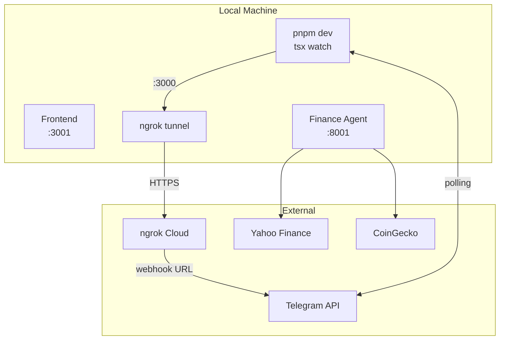
```mermaid
graph TB
    subgraph Local["Local Machine"]
        DEV[pnpm dev<br/>tsx watch]
        FRONT[Frontend<br/>:3001]
        FINANCE[Finance Agent<br/>:8001]
        NGROK[ngrok tunnel]
    end

    subgraph External["External"]
        TG[Telegram API]
        NGROK_CLOUD[ngrok Cloud]
        YAHOO[Yahoo Finance]
        GECKO[CoinGecko]
    end

    DEV -->|:3000| NGROK
    NGROK -->|HTTPS| NGROK_CLOUD
    NGROK_CLOUD -->|webhook URL| TG
    TG <-->|polling| DEV
    FINANCE --> YAHOO
    FINANCE --> GECKO
```

### 프로덕션 환경 (예정)

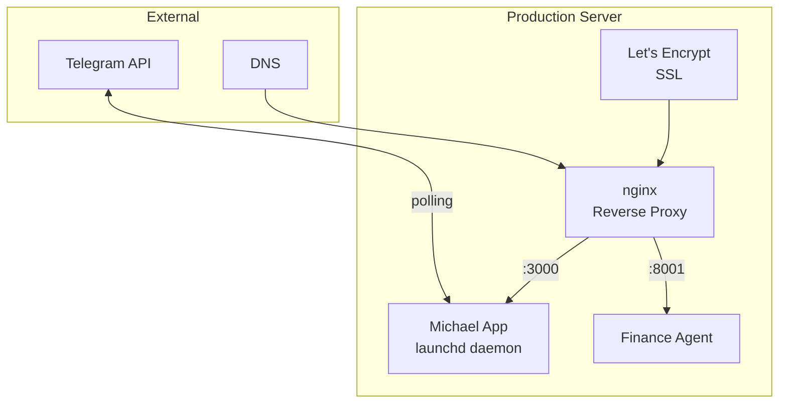
```mermaid
graph TB
    subgraph Server["Production Server"]
        NGINX[nginx<br/>Reverse Proxy]
        APP[Michael App<br/>launchd daemon]
        FINANCE[Finance Agent]
        CERT[Let's Encrypt<br/>SSL]
    end

    subgraph External["External"]
        TG[Telegram API]
        DNS[DNS]
    end

    DNS --> NGINX
    CERT --> NGINX
    NGINX -->|:3000| APP
    NGINX -->|:8001| FINANCE
    TG <-->|polling| APP
```

---

## 보안 고려사항

1. **환경 변수**: 민감 정보는 `.env` 파일에 저장, git에서 제외
2. **HTTPS**: Mini App은 ngrok/SSL로 HTTPS 필수
3. **입력 검증**: 모든 사용자 입력은 sanitize
4. **세션 관리**: WebApp 세션은 메모리에만 저장, 만료 처리
5. **API 키**: 외부 API 키(Alpha Vantage 등)는 환경변수로 관리

---

## 확장 포인트

| 영역 | 확장 방법 |
|------|----------|
| 채널 추가 | `src/channels/`에 새 채널 구현, Gateway 연결 |
| AI 모델 변경 | `src/agent/`에서 Claude CLI 대신 다른 모델 사용 |
| 저장소 변경 | `src/brain/memory.ts`의 DB 레이어 교체 |
| UI 컴포넌트 | `src/a2ui/types.ts`에 새 컴포넌트 타입 추가 |
| 특화 에이전트 | `src/agents/`에 새 에이전트 추가, A2A 프로토콜 준수 |
| 금융 데이터 소스 | `scripts/finance/`에 새 API 스크립트 추가 |
| 스킬 추가 | `.claude/skills/`에 새 스킬 디렉토리 생성 |

---

## 디렉토리 구조

```
michael/
├── src/
│   ├── core/           # Gateway, HTTP Server, Events
│   ├── brain/          # Memory (SQLite + Vector)
│   ├── channels/       # Telegram, Web Channel
│   ├── scheduler/      # Cron Scheduler
│   ├── agent/          # Claude Code Agent
│   ├── agents/         # Specialized Agents
│   │   ├── base/       # BaseA2UIAgentExecutor
│   │   └── finance/    # Finance Agent
│   ├── memory-new/     # Vector Embedding System
│   ├── a2ui/           # A2UI Types & Utils
│   └── a2a/            # A2A Protocol
├── scripts/
│   └── finance/        # Finance API Scripts
├── frontend/           # Next.js Web Frontend
├── ui/
│   └── telegram-mini-app/
├── .claude/
│   └── skills/         # Claude Code Skills
├── data/               # SQLite Databases
└── docs/               # Documentation
```

---

*마지막 업데이트: 2026-02-02*
