# Michael 시스템 아키텍처

## 개요

Michael은 24시간 깨어있는 개인 AI 어시스턴트입니다. Hub-and-Spoke 아키텍처를 채택하여 Gateway가 중앙 메시지 허브 역할을 하고, 각 컴포넌트가 WebSocket으로 연결됩니다.

---

## 전체 시스템 구조

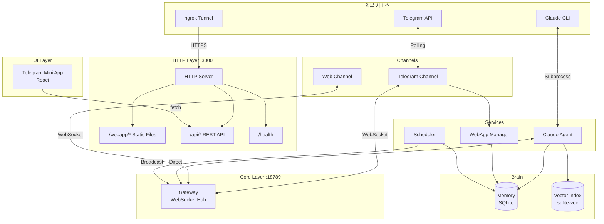

---

## 컴포넌트 상세

### 1. Gateway (WebSocket Hub)

중앙 메시지 라우터로서 모든 컴포넌트 간 통신을 중재합니다.

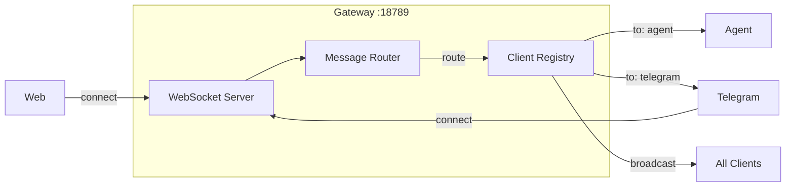

**메시지 프로토콜:**
```typescript
interface GatewayMessage {
  from: 'telegram' | 'web' | 'scheduler' | 'agent';
  to: 'agent' | 'telegram' | 'web' | 'broadcast';
  userId: string;
  content: string;
  metadata?: {
    chatId?: number;
    eventType?: string;  // AG-UI event
    runId?: string;
    // ...
  };
}
```

### 2. HTTP Server

Mini App 서빙과 REST API를 담당합니다.

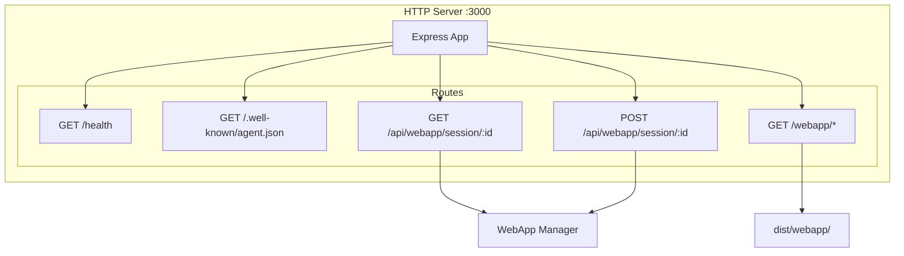

### 3. Telegram Channel

Telegram Bot API와 통신하고 Mini App을 관리합니다.

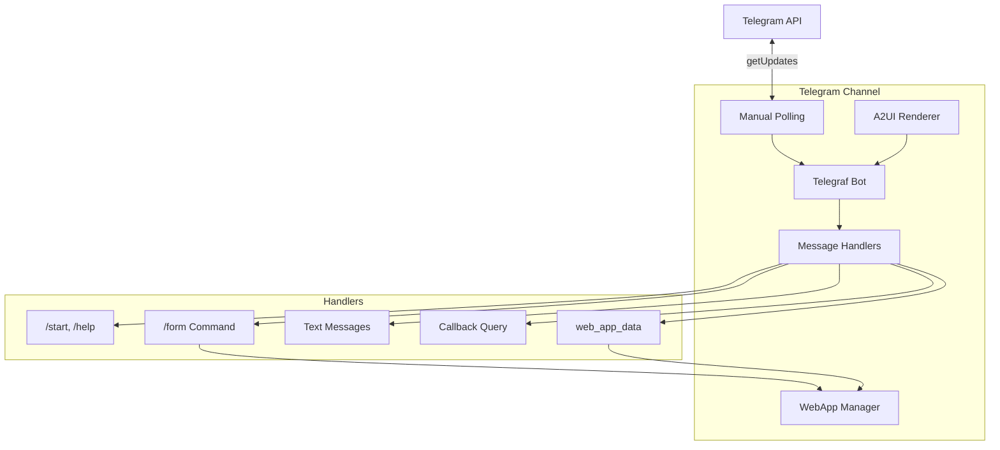

### 4. Claude Agent

Claude CLI를 subprocess로 실행하여 AI 응답을 생성합니다.

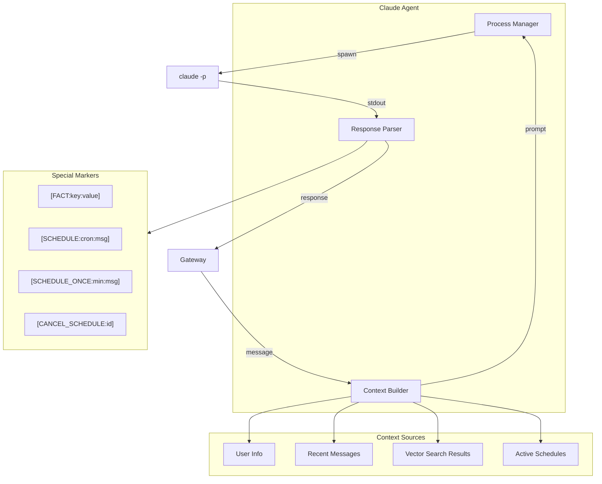

### 5. Memory System

두 개의 SQLite 데이터베이스로 구성됩니다.

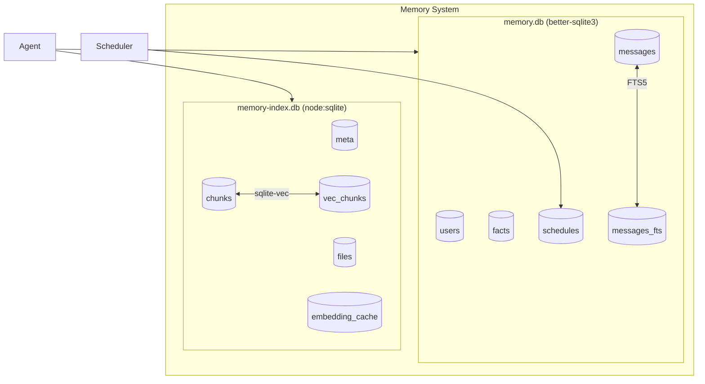

---

## 데이터 흐름

### 1. 일반 대화 흐름

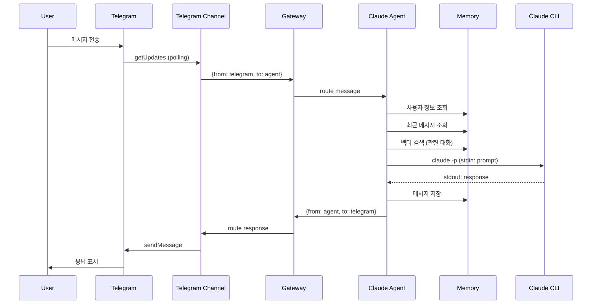

### 2. Mini App 폼 제출 흐름

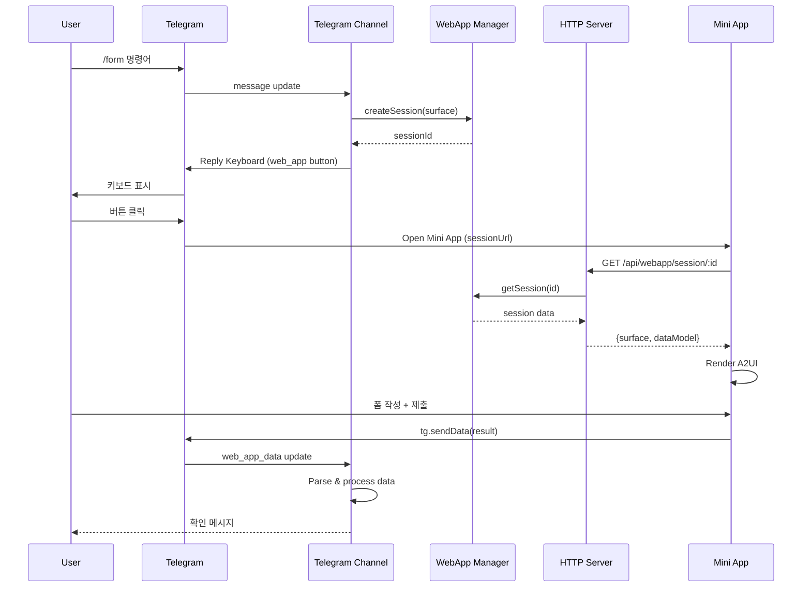

### 3. 스케줄 알림 흐름

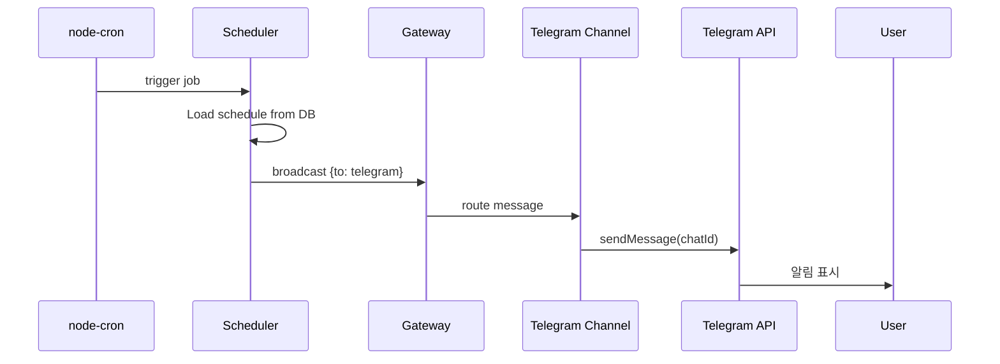

---

## 프로토콜 통합

### AG-UI (Agent-User Interface)

실시간 이벤트 스트리밍 프로토콜입니다.

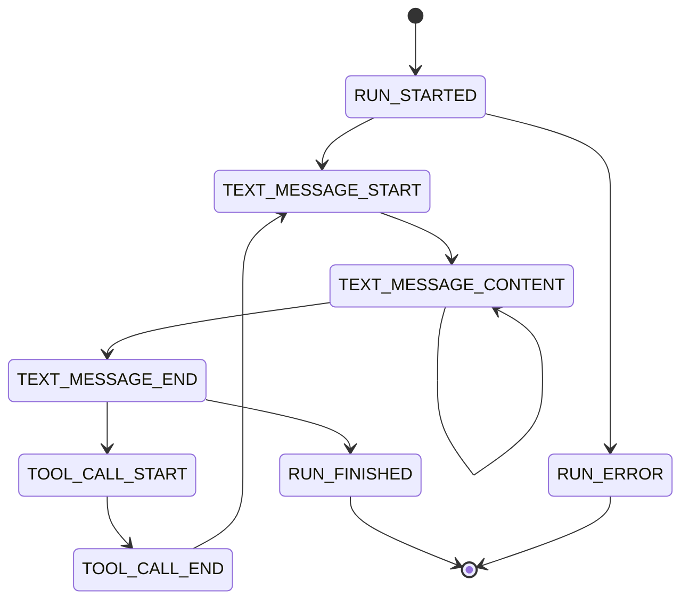

### A2UI (Agent-Driven UI)

선언적 UI 명세 프로토콜입니다.

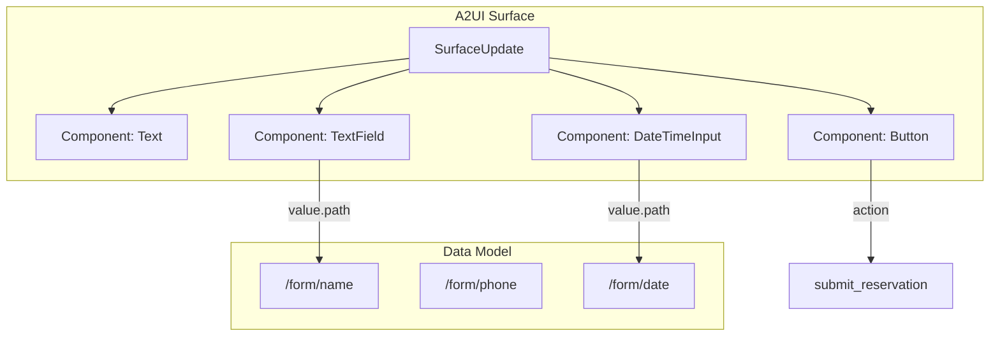

### A2A (Agent-to-Agent) v0.3.0

JSON-RPC 2.0 기반 에이전트 간 통신 프로토콜입니다.

**핵심 타입 (v0.3.0 표준):**

```typescript
// Task 구조
interface Task {
  id: string;
  contextId?: string;              // 대화 연속성을 위한 컨텍스트 ID
  status: TaskStatusInfo;          // 상태 정보 객체
  artifacts?: TaskArtifact[];      // 출력 아티팩트
  history?: A2AMessage[];          // 메시지 히스토리
  createdAt: string;
  updatedAt: string;
  error?: string;
  metadata?: Record<string, unknown>;
}

// 상태 정보 (v0.3.0)
interface TaskStatusInfo {
  state: 'pending' | 'working' | 'completed' | 'failed' | 'cancelled';
  timestamp: string;
  message?: string;
}
```

**지원 메서드:**

| 메서드 | 설명 |
|--------|------|
| `message/send` | 메시지 전송, Task 반환 |
| `message/stream` | SSE 스트리밍 응답 |
| `tasks/get` | Task 상태 조회 |
| `tasks/list` | Task 목록 조회 |
| `tasks/cancel` | Task 취소 |
| `tasks/subscribe` | Task 업데이트 SSE 구독 |
| `tasks/pushNotificationConfig/*` | 웹훅 설정 CRUD |

**에러 코드:**

| 코드 | 이름 | 설명 |
|------|------|------|
| `-32000` | TASK_NOT_FOUND | 태스크 없음 |
| `-32001` | PUSH_NOTIFICATION_NOT_SUPPORTED | 푸시 미지원 |
| `-32010` | TASK_CANCELLED | 태스크 취소됨 |
| `-32011` | AGENT_UNAVAILABLE | 에이전트 불가 |
| `-32014` | CONFIG_NOT_FOUND | 설정 없음 |

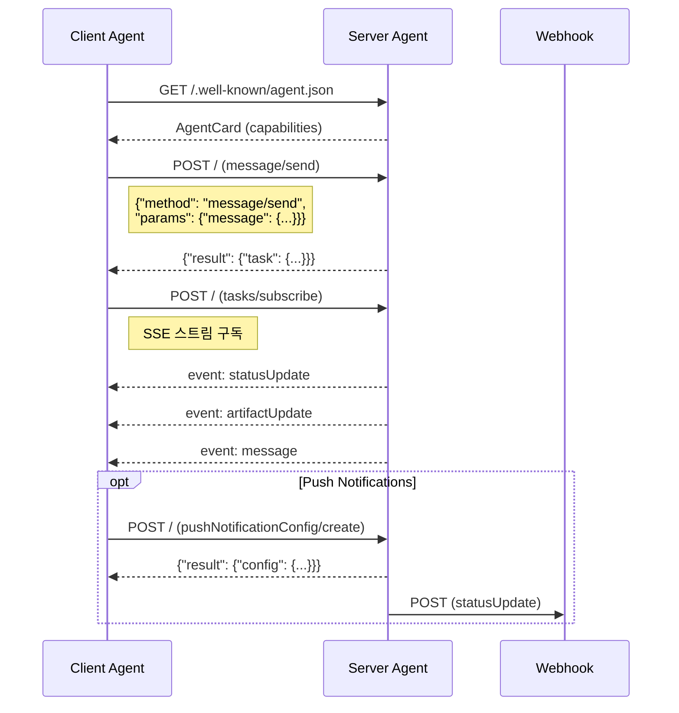

**Orchestrator (멀티 에이전트):**

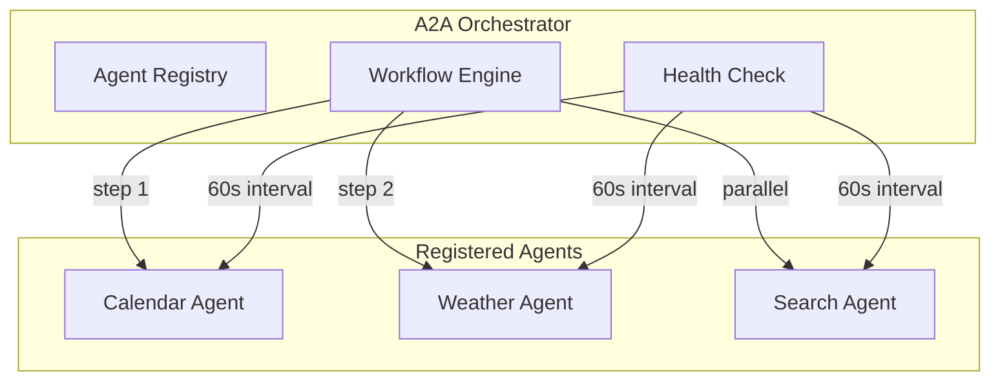

---

## 데이터베이스 스키마

### Main DB (memory.db)

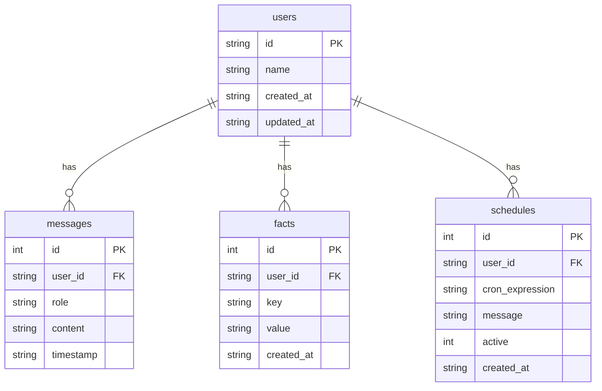

### Vector DB (memory-index.db)

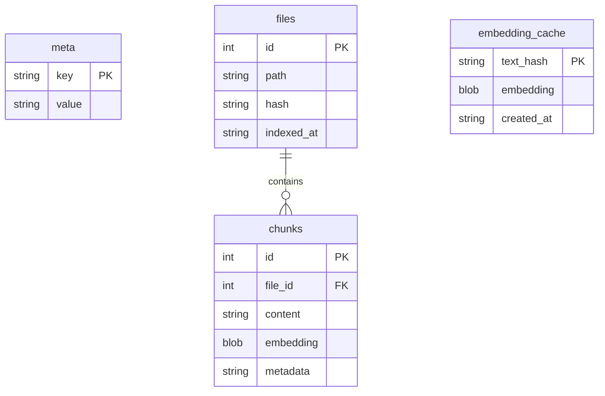

---

## 배포 아키텍처

### 개발 환경

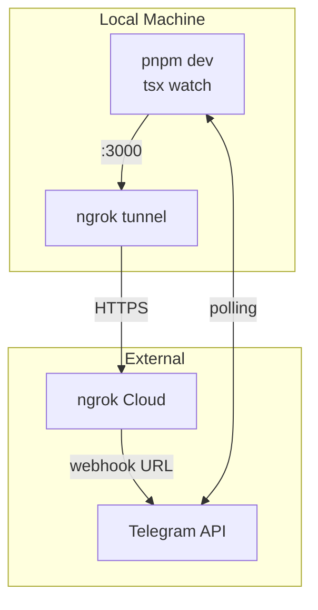

### 프로덕션 환경 (예정)

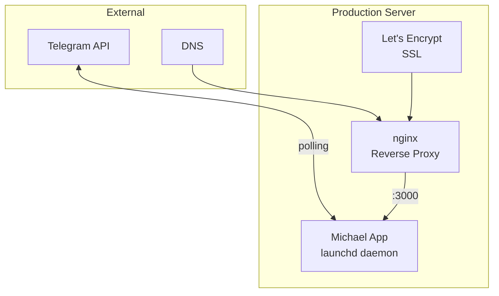

---

## 보안 고려사항

1. **환경 변수**: 민감 정보는 `.env` 파일에 저장, git에서 제외
2. **HTTPS**: Mini App은 ngrok/SSL로 HTTPS 필수
3. **입력 검증**: 모든 사용자 입력은 sanitize
4. **세션 관리**: WebApp 세션은 메모리에만 저장, 만료 처리

---

## 확장 포인트

| 영역 | 확장 방법 |
|------|----------|
| 채널 추가 | `src/channels/`에 새 채널 구현, Gateway 연결 |
| AI 모델 변경 | `src/agent/`에서 Claude CLI 대신 다른 모델 사용 |
| 저장소 변경 | `src/brain/memory.ts`의 DB 레이어 교체 |
| UI 컴포넌트 | `src/a2ui/types.ts`에 새 컴포넌트 타입 추가 |

---

*마지막 업데이트: 2026-02-02*
